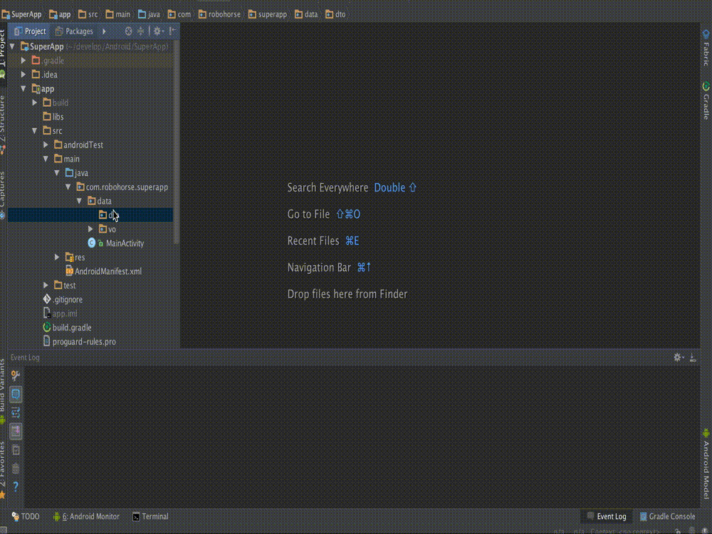
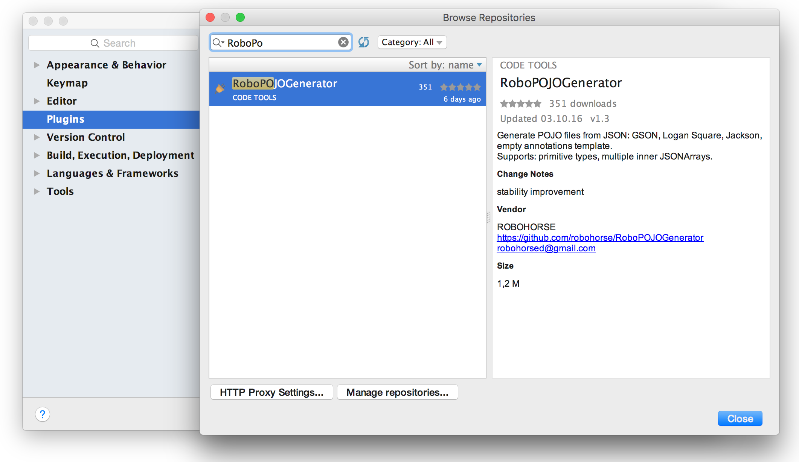
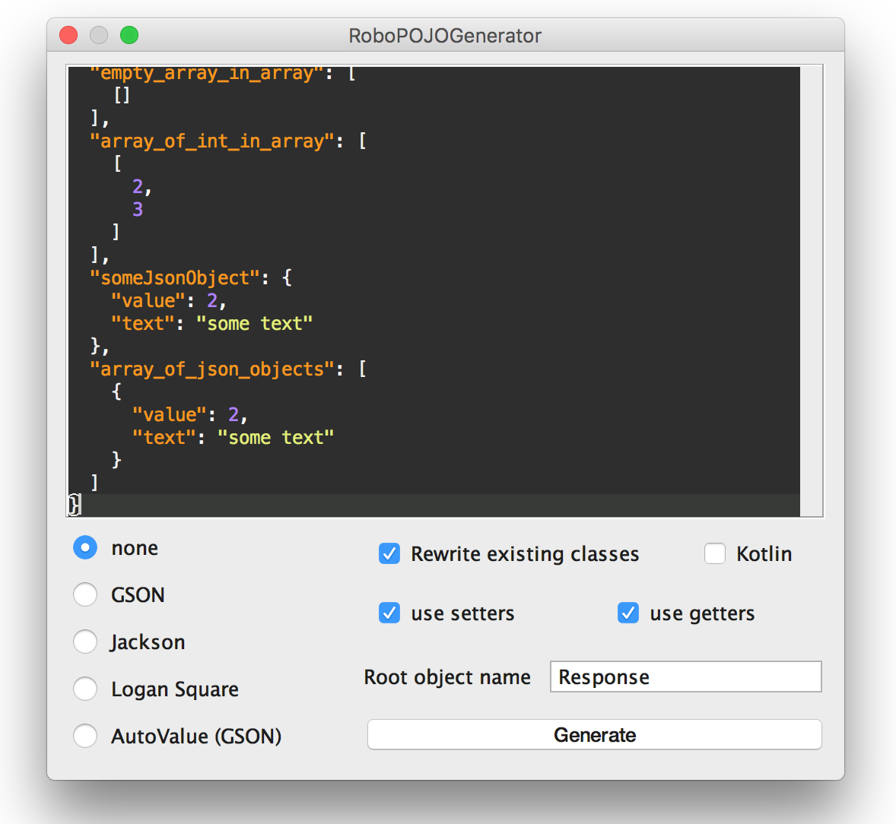
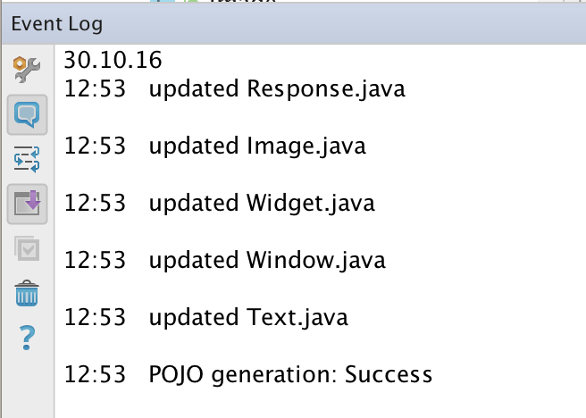

# RoboPOJOGenerator

intellij idea, Android Studio plugin for JSON to POJO conversion.

Generate POJO files from JSON: GSON, AutoValue (GSON), Logan Square, Jackson, empty annotations template.
Supports: primitive types, multiple inner JSONArrays.

# Download
get it and install from <a href="https://plugins.jetbrains.com/plugin/8634">plugin repository</a> or simply find it in "Preferences" -> "Plugins" -> "Browse Repositories" -> "RoboPOJOGenerator"

# How to use

Select target package -> new -> Generate POJO from JSON

put JSON into window and select target POJO type

see log of changes

# People, who help
[wafer-li](https://github.com/wafer-li) - Kotlin support (release 1.7)

# About
Copyright 2016 Vadim Shchenev, and licensed under the MIT license. No attribution is necessary but it's very much appreciated. Star this project if you like it.
