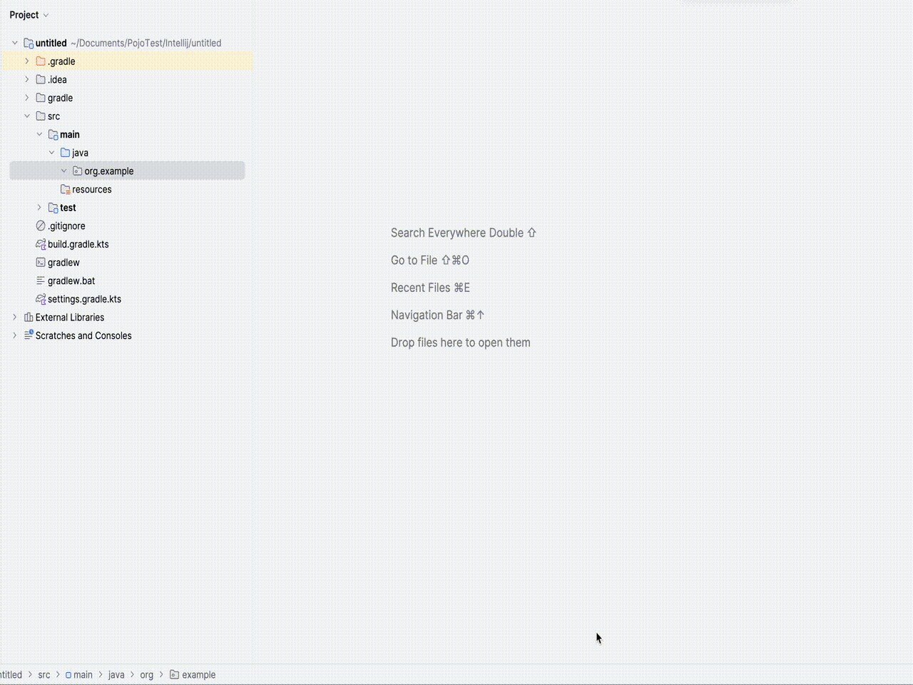
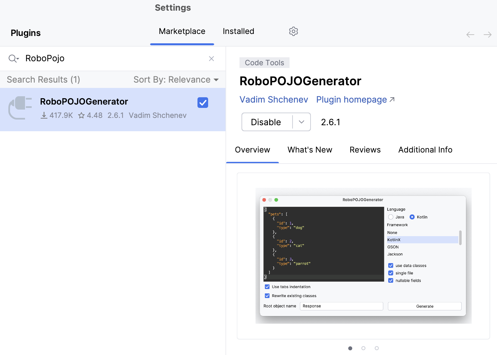
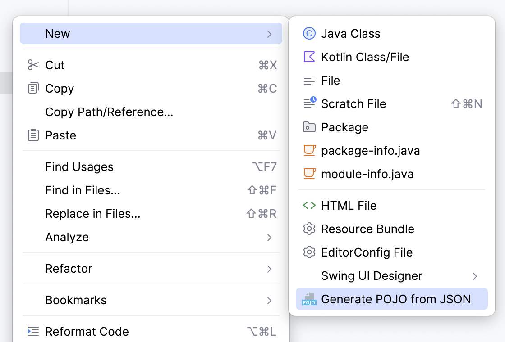
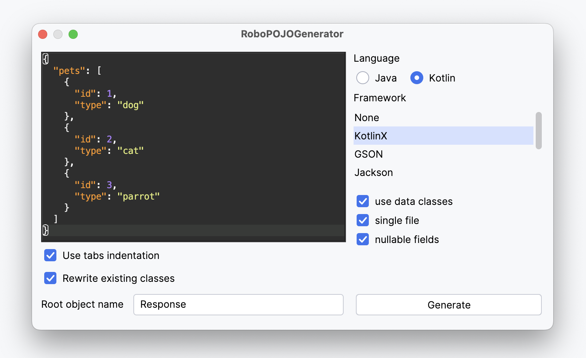

# RoboPOJOGenerator

<!-- Plugin description -->

<b>IntelliJ IDEA</b> and <b>Android Studio</b> plugin.

Generates Kotlin and Java data transfer objects from JSON payload. Just insert your JSON payload and select target serialisation framework.

<b>Keywords</b>: JsonToPojo, Json2Pojo, Kotlin, GSON, FastJSON, AutoValue, Jackson, LoganSquare, Moshi, Parcelable, Lombok, Jakarta JSON Binding, Java records, KotlinX.

<!-- Plugin description end -->

# How to install

Just get it and install from the official <a href="https://plugins.jetbrains.com/plugin/8634">plugin repository</a> or simply find it in <b>Preferences</b> -> <b>Plugins</b> -> <b>Marketplace</b> -> <b>RoboPOJOGenerator</b>

# How to use

1. Select a target package -> <b>New</b> -> <b>Generate POJO from JSON</b> 

2. Put JSON payload into the window and select target serialisation framework.

3. See generated files inside the selected package!

# Changelog
You can find it [here](https://github.com/robohorse/RoboPOJOGenerator/blob/master/CHANGELOG.md).

# About

Copyright 2016 Vadim Shchenev, and licensed under the MIT licence.

 No attribution is necessary, but it's very much appreciated.

Put a star on this project if you like it.
