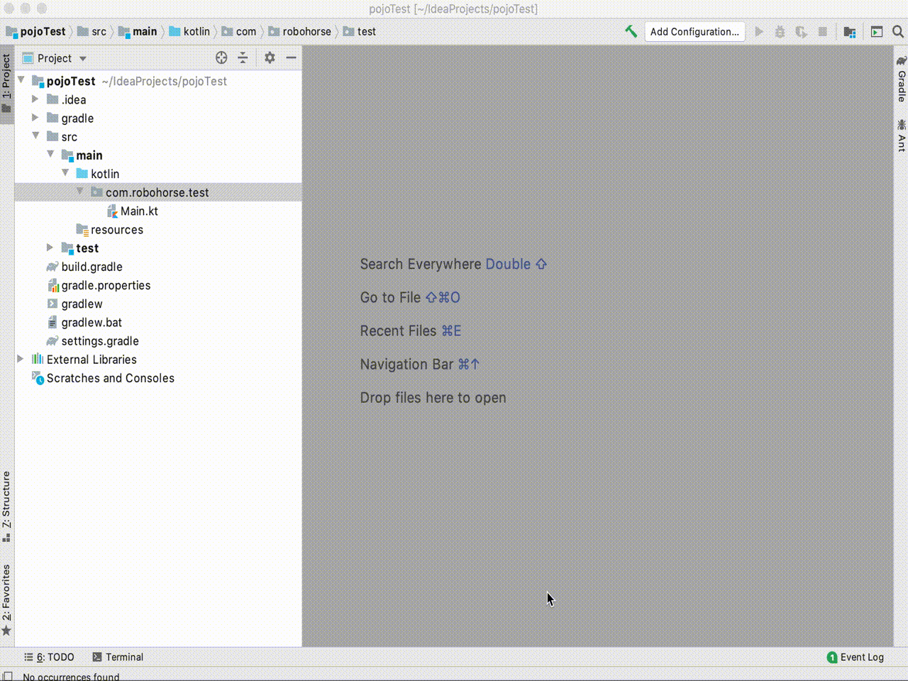
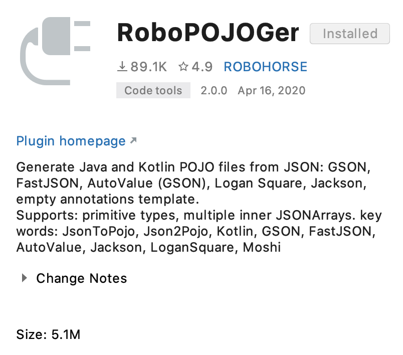
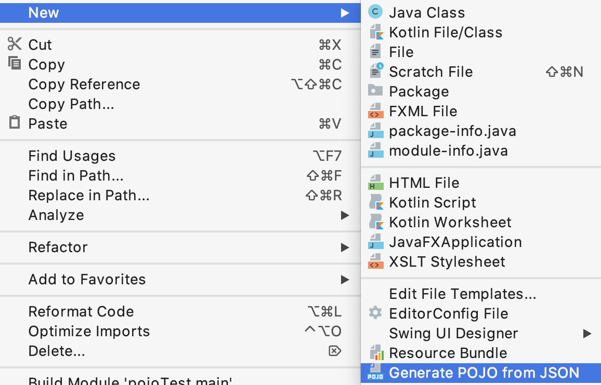
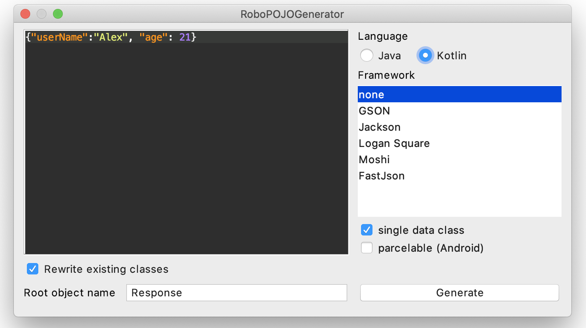
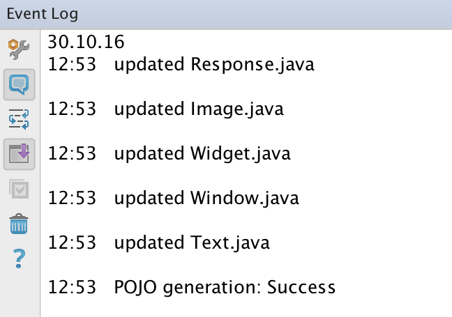

# RoboPOJOGenerator

<!-- Plugin description -->
Intellij Idea and Android Studio plugin for JSON to POJO transformation.

Generates Java and Kotlin POJO files from JSON: GSON, FastJSON, AutoValue (GSON), Logan Square, Jackson, Lombok, empty annotations template.
Supports: primitive types, multiple inner JSONArrays.

Keywords: JsonToPojo, Json2Pojo, Kotlin, GSON, FastJSON, AutoValue, Jackson, LoganSquare, Moshi, Parcelable, Lombok.
<!-- Plugin description end -->

# Download
get it and install from <a href="https://plugins.jetbrains.com/plugin/8634">plugin repository</a> or simply find it in <b>Preferences</b> -> <b>Plugins</b> -> <b>Marketplace</b> -> <b>RoboPOJOGenerator</b>

# How to use

Select target package -> new -> Generate POJO from JSON

put JSON into window and select target POJO type

see log of changes

# People, who help
<ul>
<li>
<a href="https://github.com/wafer-li">wafer-li</a> - Kotlin support (release 1.7)
</li>
<li>
<a href="https://github.com/ccqy66">ccqy66</a> - toString support (release 1.8.1)
</li>
</ul>

# About
Copyright 2016 Vadim Shchenev, and licensed under the MIT license. No attribution is necessary but it's very much appreciated. Star this project if you like it.
