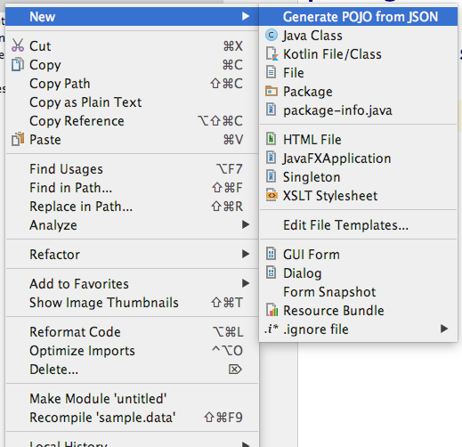
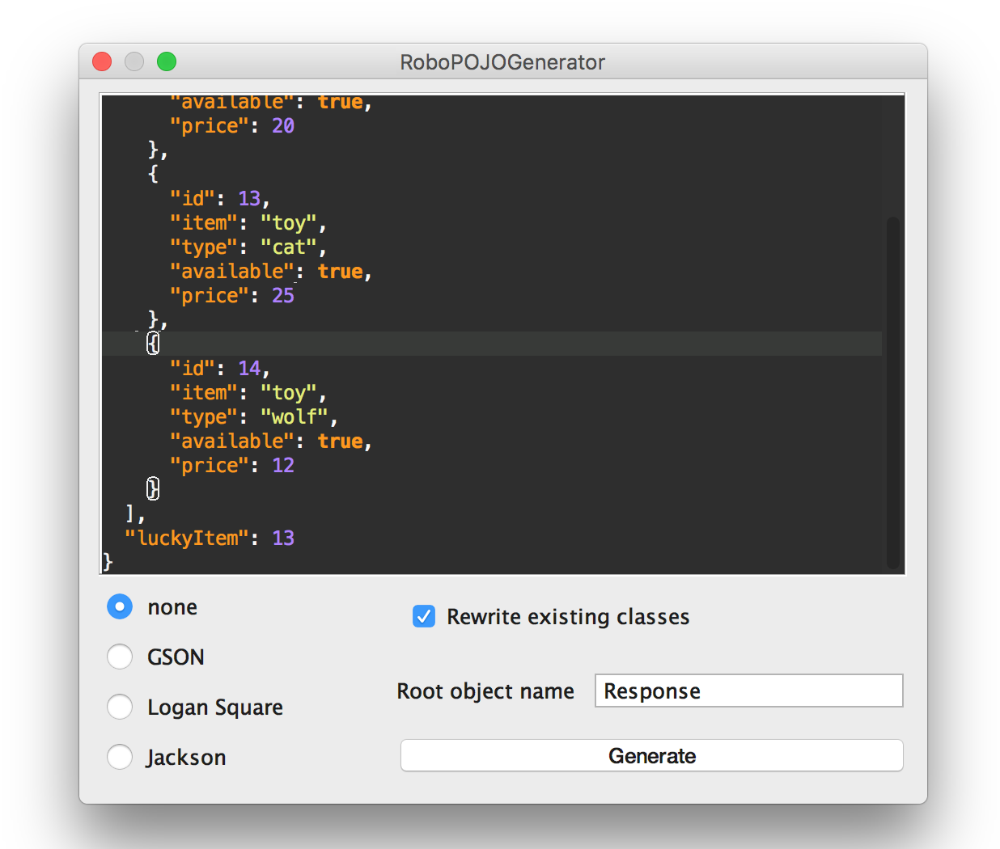
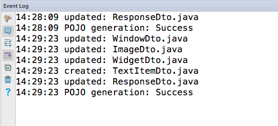

# RoboPOJOGenerator

intellij idea, Android Studio plugin for JSON to POJO conversion.

Generate POJO files from JSON: GSON, Logan Square, empty annotations template 
supports: primitive types, multiple inner JSONArrays

# Download
get it and install from plugin repository https://plugins.jetbrains.com/plugin/8634

# How to use

Select target package -> new -> Generate POJO from JSON

put JSON into window and select target POJO type

see log of changes

# About
Copyright 2016 Vadim Shchenev, and licensed under the MIT license. No attribution is necessary but it's very much appreciated. Star this project if you like it.
